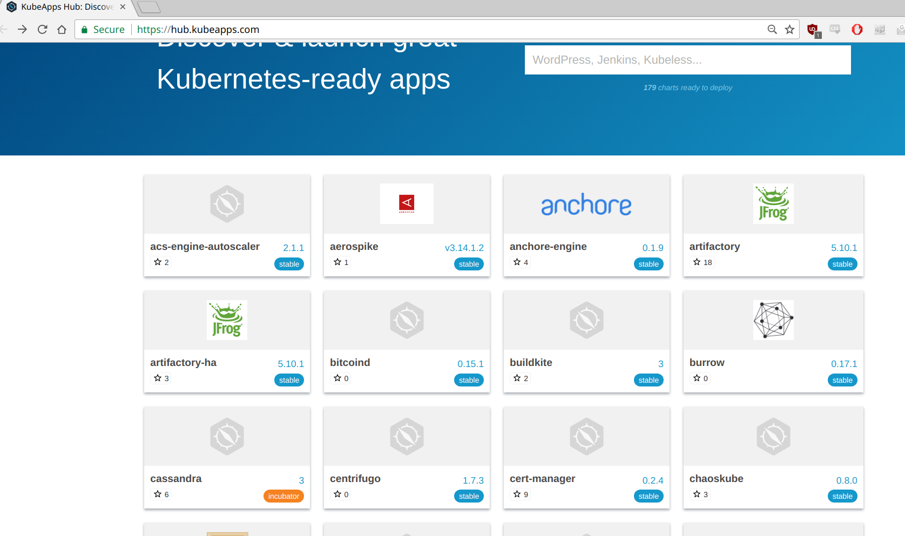

Kubernetes Helm is a package manager for Kubernetes. With helm you can simply do

```
helm install stable/mongodb
```

to deploy the MongoDB in the current namespace. A package in Helm is called a Chart, by the way.

Without helm, you would need to run `kubectl apply -f .` in a directory containing all the YAML files needed
for your application to run. And if you want to deploy your app to different namespaces, but with slightly
different configuration, you would need one YAML file per configuration. In contrast, in Helm you can do

```
helm install stable/mongodb --set mongodbUsername=root --set mongodbPassword=foo
```

or 

```
helm install stable/mongodb -f values.yaml
```

to configure the Mongodb chart.

## Task: Setup Helm and install a chart

Helm has been installed to our Kubernets cluster already, but you need to initialize Helm by running

`helm init --client-only`

Then we need to add a repository we have setup in our cluster:

`helm add repo myrepo http://TODO`

Then we can install a chart:

`helm install myrepo/mariadb`


TODO find out url above

TODO download charts to our chart repo

## Repository browser

There's a bunch of ready charts at http://kubeapps.com:



You can install your own "kubeapps", that is, a repository. Then you have a very simple way of browsing
the various applications in your organization.

