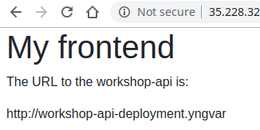



ConfigMap documentation:

* [Offline]({{host.offline}}{{path}})

* [Online]({{host.online}}{{path}})

A ConfigMap allows the storage of configuration outside of the container image. This provides portability for containers. ConfigMaps can be used to store environment variables or to populate volumes inside the container.

A configmap can either be created manually by specifying a yaml file, or by `kubectl create configmap`


## Task 1

Create a configmap with `kubectl`. The configmap should contain a literal `BACKEND_URL`. The value should be a callable service in the cluster, and should be in the form: `http://[service-name].[namespace]:[service-port]`.

Example: `BACKEND_URL="http://super-backend.tord-kloster:80"`

<details>
<summary>Solution</summary>
<div markdown="1">

```
kubectl create configmap super-configmap --from-literal=BACKEND_URL=http://workshop-api-deployment.yngvar-kristiansen
```

(Port 80 is the default, so we don't need to specify it.)

</div>
</details>

## Task 2

Load the configmap as environment variables in the front-end pod.

The deployment for the front-end is by now the current YAML:

```yaml
apiVersion: extensions/v1beta1
kind: Deployment
metadata:
  labels:
    app: ez-frontend
  name: ez-frontend
spec:
  replicas: 1
  selector:
    matchLabels:
      app: ez-frontend
  template:
    metadata:
      labels:
        app: ez-frontend
    spec:
      containers:
      - image: torklo/workshop-frontend
        imagePullPolicy: Always
        name: workshop-frontend
      restartPolicy: Always
```

<details>
  <summary>Solution</summary>
  <div markdown="1">

- In the deployment yaml file configure the container to use environment from the configmap. Re-apply the yaml file as you did in the `deployment` section.  

```yaml
containers:
  - name: {....}
    envFrom:
    - configMapRef:
        name: super-configmap # name of your configmap
```

```
kubectl apply -f workshop-frontend-deployment.yaml # or whatever you called the yaml file earlier
```

Now your pod in your deployment should be restarted by Kubernetes.

After the frontend pod has been restarted, visit the frontend in the browser again. Notice that the frontend now displays the contents of the environment variable:



</div>
</details>

## Task 3

The Kubernetes cluster automatically loadbalances pods that are replicated. To see for
yourself, open your front end, and click the button to do a request. (By this time in the guide it should be
configured to do requests against the backend.)

(To find the host IP, run `kubectl get nodes -owide`. And use `kubectl get svc` to find the nodeport)

You should see that each response is different, because it is a different pod that responds.




## Task 3

Create a configuration file inside the container using a ConfigMap. Mount the file at ***/config/greatestconfig.yml***. The enpoint ***/configmap*** in the sample app can then be used to view contents of the ConfigMap.

<details>
  <summary>Step-by-step Task 3</summary>
  <div markdown="1">

### Step 1, ConfigMap

```yaml
apiVersion: v1
kind: ConfigMap
metadata:
  name: ## give it a name
  labels:
    ## and a describing label or two
data:
  greatestconfig.yml: |-
    - module: myawesomemodule
      start_at_boot: true
```

### Step 2, In your previous deployment file, add the following

```yaml
apiVersion: apps/v1
kind: Deployment
...
      containers:
      - name: sample-app
        image: ubuntu-k8s-1.local:30603/sample-app
        imagePullPolicy: IfNotPresent
        ports:
        - containerPort: 8080
        volumeMounts:
        - name: # Name of the volume you want to mount
          mountPath: /config/greatestconfig.yml
          readOnly: true
          subPath: greatestconfig.yml
      volumes:
      - name: # Give the volume a name
        configMap:
          defaultMode: 0600
          name: # reference the configmap name
```
  </div>
</details>


